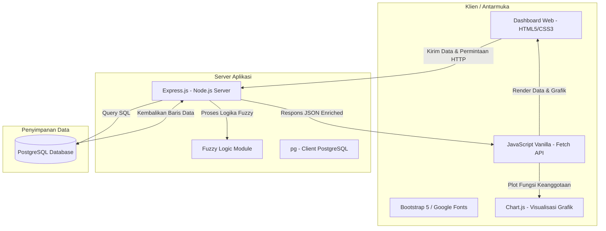

# LAPORAN PROYEK KECERDASAN BUATAN
## SISTEM EVALUASI DAN PENILAIAN HASIL BELAJAR SISWA BERBASIS LOGIKA FUZZY

---

**Dosen Pengampu:** P. Hendro  
**Program Studi:** Teknik Informatika / Rekayasa Perangkat Lunak  
**Tanggal Proyek:** 29 Mei 2026  

---

## 1. PENDAHULUAN

### 1.1 Latar Belakang
Proses penilaian hasil belajar siswa secara konvensional umumnya mengandalkan sistem nilai rata-rata tegas (crisp) yang diubah ke dalam predikat nilai (misalnya: Kurang, Cukup, Baik) menggunakan rentang batas tegas (hard threshold). Contohnya, jika nilai rata-rata kelulusan predikat "Baik" ditetapkan minimal 75, maka siswa dengan nilai 74.9 akan mendapatkan predikat "Cukup", sementara siswa dengan nilai 75.0 mendapatkan predikat "Baik". Perbedaan tipis sebesar 0.1 poin ini menghasilkan perbedaan predikat yang signifikan. Pendekatan semacam ini dinilai kurang fleksibel dan kurang mencerminkan variabilitas kemampuan siswa di batas wilayah transisi.

Logika Fuzzy (*Fuzzy Logic*) yang pertama kali diperkenalkan oleh Lotfi A. Zadeh menawarkan solusi atas keterbatasan logika Boolean biner tersebut. Dengan menggunakan logika fuzzy, transisi predikat penilaian tidak dilakukan secara tegas melainkan secara bertahap melalui **derajat keanggotaan** ($\mu$) dalam rentang $[0, 1]$. Sistem penilaian ini mengakomodasi wilayah ketidakpastian (*ambiguity*) pada batas predikat nilai, sehingga keputusan predikat akhir didasarkan pada derajat kecenderungan yang paling dominan, menghasilkan sistem evaluasi yang lebih adil dan informatif.

### 1.2 Tujuan
Tujuan dari proyek ini adalah:
1. Merancang dan mengimplementasikan sistem evaluasi penilaian siswa dengan metode Logika Fuzzy.
2. Membangun aplikasi berbasis web (Client-Server) yang mengintegrasikan penginputan nilai, kalkulasi fuzzy otomatis, visualisasi grafik interaktif, dan manajemen database siswa.
3. Menyediakan antarmuka dashboard yang intuitif untuk membantu guru/dosen menganalisis hasil belajar siswa.

---

## 2. ARSITEKTUR SISTEM

Aplikasi ini dibangun menggunakan arsitektur **Client-Server (Decoupled Architecture)** dengan tiga komponen utama:



1. **Frontend (Sisi Klien):**
   - **HTML5 & Vanilla CSS:** Digunakan untuk merancang struktur dan gaya tata letak aplikasi.
   - **Bootstrap 5:** Kerangka kerja CSS untuk mempercepat pembuatan desain dashboard yang responsif, modern, dan ramah seluler.
   - **JavaScript (ES6):** Mengatur alur logika asinkronus (AJAX) menggunakan *Fetch API*, manipulasi DOM, manajemen tab, serta interaksi visual.
   - **Chart.js:** Pustaka visualisasi data berbasis Canvas untuk menggambar sebaran statistik predikat siswa (Doughnut Chart) dan plot fungsi keanggotaan fuzzy (Scatter Line Chart) secara interaktif.

2. **Backend (Sisi Server):**
   - **Node.js & Express.js:** Server HTTP yang menangani rute API, validasi data masukan, dan menjembatani frontend dengan database.
   - **Fuzzy Module:** Algoritma internal untuk memproses nilai rata-rata masukan menjadi derajat keanggotaan fuzzy dan memprediksi predikat siswa.

3. **Database (Penyimpanan Data):**
   - **PostgreSQL:** Sistem manajemen database relasional (RDBMS) tangguh yang bertugas menyimpan data master siswa dan riwayat penilaian.

---

## 3. METODOLOGI LOGIKA FUZZY

Sistem ini menerapkan metode penentuan keputusan berbasis derajat keanggotaan tertinggi dari rata-rata nilai empat mata pelajaran utama: **Matematika, Bahasa Indonesia, Bahasa Inggris,** dan **IPA**.

### 3.1 Defini Variabel
*   **Variabel Input (Semesta Pembicaraan):** Rata-rata Nilai ($x$), di mana $x \in [0, 100]$.
*   **Variabel Output (Himpunan Fuzzy):** Predikat Penilaian, terbagi atas tiga kategori: **Kurang, Cukup,** dan **Baik**.

### 3.2 Fungsi Keanggotaan (Fuzzifikasi)

Fungsi keanggotaan yang digunakan dirancang secara hibrida menggunakan representasi kurva linear turun, segitiga/trapesium, dan kurva linear naik.

```
Derajat Keanggotaan (μ)
  1.0 |-------\                               /---------
      |        \                             /
      |         \                           /
  0.5 |          \           /\            /
      |           \         /  \          /
      |            \       /    \        /
  0.0 +-------------*-----*------*------*---------------
      0            60    70  75  85    90              100
                         Nilai Rata-rata (x)
      [ Rendah (Merah) ]   [ Sedang (Kuning) ]   [ Tinggi (Hijau) ]
```

#### 3.2.1 Himpunan Fuzzy: Rendah
Kurva keanggotaan **Rendah** merepresentasikan nilai siswa yang berada di bawah standar minimum. Menggunakan representasi linear turun dengan batas atas 70 dan batas bawah 60.

$$
\mu_{Rendah}(x) = \begin{cases} 
1, & x \le 60 \\ 
\frac{70 - x}{10}, & 60 < x < 70 \\ 
0, & x \ge 70 
\end{cases}
$$

#### 3.2.2 Himpunan Fuzzy: Sedang
Kurva keanggotaan **Sedang** merepresentasikan nilai rata-rata siswa menengah/cukup. Menggunakan fungsi segitiga dengan puncak derajat keanggotaan bernilai 1 tepat pada nilai rata-rata 75, dengan batas kiri 60 dan batas kanan 85.

$$
\mu_{Sedang}(x) = \begin{cases} 
0, & x \le 60 \text{ atau } x \ge 85 \\ 
\frac{x - 60}{15}, & 60 < x < 75 \\ 
1, & x = 75 \\
\frac{85 - x}{10}, & 75 < x < 85 
\end{cases}
$$

#### 3.2.3 Himpunan Fuzzy: Tinggi
Kurva keanggotaan **Tinggi** merepresentasikan nilai prestasi siswa yang memuaskan. Menggunakan representasi linear naik dengan batas bawah 75 dan batas atas 90.

$$
\mu_{Tinggi}(x) = \begin{cases} 
0, & x \le 75 \\ 
\frac{x - 75}{15}, & 75 < x < 90 \\ 
1, & x \ge 90 
\end{cases}
$$

### 3.3 Penentuan Keputusan (Defuzzifikasi / Inferensi)
Karena hanya terdapat satu variabel masukan ($x$ sebagai nilai rata-rata dari empat mata pelajaran) dan satu variabel luaran (Predikat), proses inferensi disederhanakan dengan memilih nilai predikat yang berkorespondensi dengan derajat keanggotaan terbesar (Metode Maksimum atau **Max-Operator**).

$$
\text{Predikat Akhir} = \text{Himpunan Fuzzy dengan } \max(\mu_{Rendah}(x), \mu_{Sedang}(x), \mu_{Tinggi}(x))
$$

---

## 4. PERANCANGAN DATABASE (SKEMA)

Database relasional yang digunakan bernama `fuzzy_nilai` dengan struktur dua tabel utama yang saling berelasi:

### 4.1 Tabel `siswa`
Tabel ini berfungsi sebagai tabel master untuk menampung data identitas siswa.

| Nama Kolom | Tipe Data | Atribut / Keterangan |
| :--- | :--- | :--- |
| `id` | `INTEGER` | `PRIMARY KEY`, `SERIAL` (Auto-increment) |
| `nis` | `VARCHAR` | `UNIQUE`, `NOT NULL` (Nomor Induk Siswa) |
| `nama` | `VARCHAR` | `NOT NULL` (Nama Lengkap Siswa) |
| `kelas` | `VARCHAR` | `NOT NULL` (Nama Rombongan Belajar) |

### 4.2 Tabel `nilai`
Tabel ini menampung data nilai mata pelajaran, nilai rata-rata hitung, dan keputusan predikat fuzzy.

| Nama Kolom | Tipe Data | Atribut / Keterangan |
| :--- | :--- | :--- |
| `id` | `INTEGER` | `PRIMARY KEY`, `SERIAL` (Auto-increment) |
| `siswa_id` | `INTEGER` | `FOREIGN KEY` references `siswa(id)` ON DELETE CASCADE, `UNIQUE` |
| `matematika` | `INTEGER` | Nilai Matematika ($0-100$) |
| `bahasa_indonesia` | `INTEGER` | Nilai Bahasa Indonesia ($0-100$) |
| `bahasa_inggris` | `INTEGER` | Nilai Bahasa Inggris ($0-100$) |
| `ipa` | `INTEGER` | Nilai Ilmu Pengetahuan Alam ($0-100$) |
| `rata_rata` | `NUMERIC` | Nilai rata-rata aritmatika dari 4 mata pelajaran |
| `predikat` | `VARCHAR` | Hasil keputusan fuzzy (`Kurang`, `Cukup`, `Baik`) |

*Catatan: Atribut `ON DELETE CASCADE` pada foreign key `siswa_id` menjamin integritas data secara otomatis, di mana apabila data siswa dihapus dari tabel master, seluruh baris riwayat nilainya di tabel nilai akan ikut terhapus otomatis.*

---

## 5. FITUR UI/UX DASHBOARD BARU

Dashboard baru dirancang untuk memberikan kenyamanan dan fungsionalitas bagi pengguna dengan standar kegunaan (UX) yang tinggi:

1. **Desain Sidebar Menu Dinamis:**
   Mengadopsi layout panel samping (*sidebar*) warna Slate gelap (`#0f172a`) yang meluncur responsif. Pengguna dapat berganti konteks layar (Dashboard, Input Nilai, Kelola Siswa) tanpa memuat ulang browser (konsep SPA).
2. **Kartu Ringkasan Metrik (KPI Cards):**
   Di bagian atas layar Dashboard terdapat empat kartu dengan efek warna tepi berkode khusus yang merangkum metrik penting secara instan: *Total Siswa*, *Siswa Dinilai*, *Rata-Rata Nilai Kelas*, dan *Predikat Dominan*.
3. **Grafik Statistik Sebaran (Chart.js Doughnut):**
   Membantu administrator memvisualisasikan rasio pencapaian belajar siswa dalam bentuk persentase potongan lingkaran yang interaktif.
4. **Live Fuzzy Preview Panel:**
   Di dalam menu Input Nilai, terdapat panel pendamping hitam-premium. Saat pengguna sedang menginputkan nilai, JavaScript di balik layar langsung menghitung rata-rata estimasi beserta nilai derajat keanggotaan $\mu$ secara *real-time*. Progress bar mikro akan bergeser otomatis dan warna lencana predikat berubah seiring ketukan keyboard pengguna.
5. **Modal Analisis Grafik Logika Fuzzy:**
   Saat ikon detail diklik pada tabel Dashboard, sebuah jendela modal Bootstrap akan muncul dengan diagram kartesius dinamis yang digambar oleh Chart.js. Kurva Rendah (merah), Sedang (kuning), dan Tinggi (hijau) diplot di dalam diagram tersebut. Garis vertikal putus-putus berwarna biru ditarik di sepanjang nilai rata-rata siswa untuk menunjukkan letak matematis predikat tersebut diambil.
6. **Toast Notification System:**
   Mengganti fungsi bawaan `alert()` bawaan browser yang memblokir layar dengan balon pesan kustom *Toast* Bootstrap yang muncul lembut di sudut kanan atas layar saat transaksi berhasil/gagal.

---

## 6. ANALISIS SIMULASI KASUS UJI

Berikut adalah simulasi matematis logika fuzzy untuk memvalidasi algoritma yang diimplementasikan pada sistem:

### Kasus Uji 1: Nilai Sangat Rendah
*   **Data Nilai:** Matematika = 50, Bahasa Indonesia = 60, Bahasa Inggris = 55, IPA = 45.
*   **Nilai Rata-rata ($x$):** $(50 + 60 + 55 + 45) / 4 = 52.50$
*   **Kalkulasi Fuzzy:**
    *   $\mu_{Rendah}(52.5) = 1.0$ (karena $52.5 \le 60$)
    *   $\mu_{Sedang}(52.5) = 0.0$ (karena $52.5 \le 60$)
    *   $\mu_{Tinggi}(52.5) = 0.0$ (karena $52.5 \le 75$)
*   **Hasil Defuzzifikasi:** $\max(1.0, 0.0, 0.0) \rightarrow$ **Kurang** (Derajat: 1.00)

### Kasus Uji 2: Area Transisi (Rendah ke Sedang)
*   **Data Nilai:** Matematika = 65, Bahasa Indonesia = 68, Bahasa Inggris = 60, IPA = 67.
*   **Nilai Rata-rata ($x$):** $(65 + 68 + 60 + 67) / 4 = 65.00$
*   **Kalkulasi Fuzzy:**
    *   $\mu_{Rendah}(65.0) = \frac{70 - 65}{10} = \frac{5}{10} = 0.50$
    *   $\mu_{Sedang}(65.0) = \frac{65 - 60}{15} = \frac{5}{15} = 0.33$
    *   $\mu_{Tinggi}(65.0) = 0.0$ (karena $65 \le 75$)
*   **Hasil Defuzzifikasi:** $\max(0.50, 0.33, 0.0) \rightarrow$ **Kurang** (Derajat: 0.50)
*   *Analisis UX:* Pada grafik interaktif di aplikasi, garis rata-rata siswa akan terlihat berada di tengah persimpangan kurva merah (Rendah) dan kuning (Sedang), tetapi sistem memilih predikat "Kurang" karena derajatnya lebih dominan (0.50 dibanding 0.33).

### Kasus Uji 3: Nilai Menengah Sempurna (Cukup)
*   **Data Nilai:** Matematika = 75, Bahasa Indonesia = 75, Bahasa Inggris = 75, IPA = 75.
*   **Nilai Rata-rata ($x$):** $75.00$
*   **Kalkulasi Fuzzy:**
    *   $\mu_{Rendah}(75) = 0.0$ (karena $75 \ge 70$)
    *   $\mu_{Sedang}(75) = 1.0$ (karena $75 == 75$)
    *   $\mu_{Tinggi}(75) = 0.0$ (karena $75 \le 75$)
*   **Hasil Defuzzifikasi:** $\max(0.0, 1.0, 0.0) \rightarrow$ **Cukup** (Derajat: 1.00)

### Kasus Uji 4: Area Transisi (Sedang ke Tinggi)
*   **Data Nilai:** Matematika = 80, Bahasa Indonesia = 80, Bahasa Inggris = 80, IPA = 80.
*   **Nilai Rata-rata ($x$):** $80.00$
*   **Kalkulasi Fuzzy:**
    *   $\mu_{Rendah}(80) = 0.0$
    *   $\mu_{Sedang}(80) = \frac{85 - 80}{10} = \frac{5}{10} = 0.50$
    *   $\mu_{Tinggi}(80) = \frac{80 - 75}{15} = \frac{5}{15} = 0.33$
*   **Hasil Defuzzifikasi:** $\max(0.0, 0.50, 0.33) \rightarrow$ **Cukup** (Derajat: 0.50)

### Kasus Uji 5: Nilai Tinggi (Baik)
*   **Data Nilai:** Matematika = 90, Bahasa Indonesia = 95, Bahasa Inggris = 92, IPA = 91.
*   **Nilai Rata-rata ($x$):** $(90 + 95 + 92 + 91) / 4 = 92.00$
*   **Kalkulasi Fuzzy:**
    *   $\mu_{Rendah}(92) = 0.0$
    *   $\mu_{Sedang}(92) = 0.0$ (karena $92 \ge 85$)
    *   $\mu_{Tinggi}(92) = 1.0$ (karena $92 \ge 90$)
*   **Hasil Defuzzifikasi:** $\max(0.0, 0.0, 1.0) \rightarrow$ **Baik** (Derajat: 1.00)

---

## 7. KESIMPULAN

Implementasi Logika Fuzzy dalam sistem evaluasi penilaian siswa telah berhasil direalisasikan dengan baik. Sistem ini terbukti mampu memetakan nilai rata-rata akademik yang dinamis ke dalam predikat kualitatif secara lebih presisi melalui fungsi keanggotaan bertingkat. Transisi predikat pada area kritis transisi (seperti nilai rata-rata 65 dan 80) dapat diselesaikan dengan adil melalui penentuan derajat kecenderungan tertinggi (*Max-operator*).

Melalui penyegaran visual ke dalam format dashboard modern berbasis Bootstrap 5 dan penyediaan visualisasi grafik dinamis Chart.js, antarmuka aplikasi menjadi jauh lebih profesional, informatif, dan memiliki daya guna tinggi (*high usability*) untuk kebutuhan praktis di institusi pendidikan.
